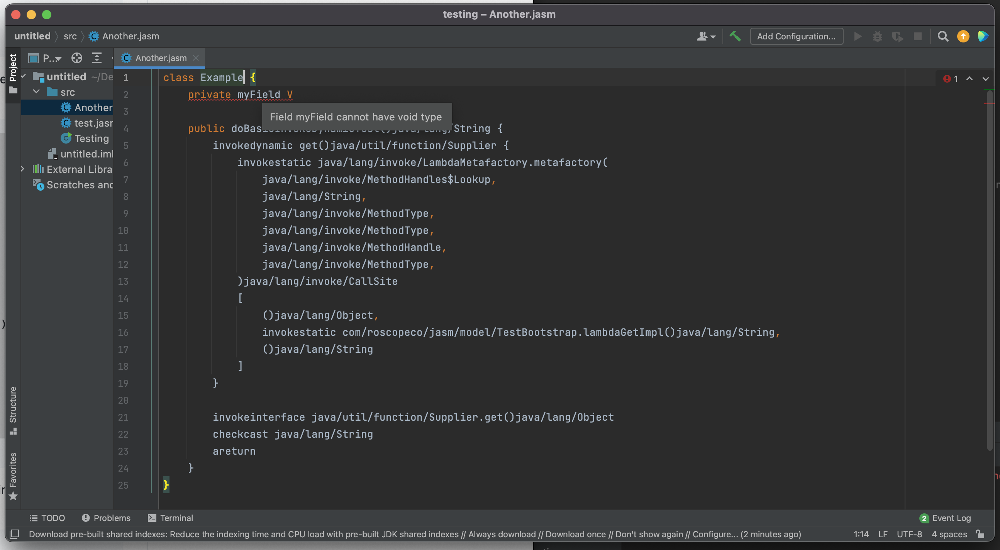

# jasm-intellij-plugin

> **note**: This repository is archived and the plugin is discontinuted. Development of JASM itself will continue but I cannot commit to keeping the plugin up to date.

<!-- Plugin description -->
IntelliJ platform plugin for the [JASM](https://github.com/roscopeco/jasm) Java assembler.

Supports:

* Syntax highlighting for JASM source code
* Configurable code style and formatting
* Basic refactoring (WIP)

<!-- Plugin description end -->

## Screenshot

## Installation

- Using IDE built-in plugin system:
  
  <kbd>Settings/Preferences</kbd> > <kbd>Plugins</kbd> > <kbd>Marketplace</kbd> > <kbd>Search for "jasm-intellij-plugin"</kbd> >
  <kbd>Install Plugin</kbd>
  
- Manually:

  Download the [latest release](https://github.com/roscopeco/jasm-intellij-plugin/releases/latest) and install it manually using
  <kbd>Settings/Preferences</kbd> > <kbd>Plugins</kbd> > <kbd>⚙️</kbd> > <kbd>Install plugin from disk...</kbd>

---
Plugin based on the [IntelliJ Platform Plugin Template][template].

[template]: https://github.com/JetBrains/intellij-platform-plugin-template
